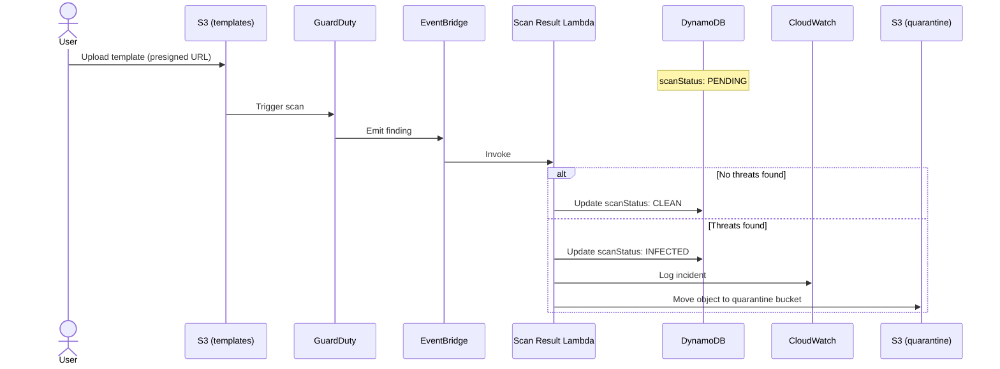

# GuardDuty malware scan

## Context

Users upload HTML templates to S3. These templates are later downloaded, compiled with Handlebars, and rendered by Puppeteer to produce PDFs. The upload pipeline performs no validation of file content - only a client-supplied file size hint is checked before issuing the presigned URL.

HTML files are not traditional malware vectors and are unlikely to trigger signature-based scanners. However, the system currently enforces no file type restriction, meaning any file can be uploaded. Establishing a malware scanning pipeline now ensures that if the application ever expands to accepting richer file types (DOCX, ZIP archives, images with embedded payloads), the safety net is already in place without requiring architectural changes.

## Decision

Enable GuardDuty Malware Protection for S3 on the application bucket. The response pipeline works as follows:

1. On every template upload, GuardDuty automatically scans the object.
2. GuardDuty sends scan result to EventBridge.
3. An EventBridge rule triggers Lambda that adds malware scan result to template. If the file is malicious, it logs the issue and quarantines the S3 object to a restricted S3 bucket with a 30-day lifecycle expiry, to allow false positive recovery and forensic inspection.

This approach delegates scanning infrastructure entirely to AWS while offering very low costs for low loads. As number of template uploads is generally low - one template is used to generate many documents this fits with our use case well.

## Alternatives considered

### No scanning

Acceptable given that current uploads are HTML only, which are low-risk for traditional malware. We choose not to rely on this assumption, as the file type is not enforced strictly and in the future we may support additional file types.

### 3rd party malware scan on AWS

Running [BucketAV](https://bucketav.com/) on AWS would allow us to scan files in a similar way, while removing some of the limitations of GuardDuty such bucket limits or missing on demand scan. We choose not to use it, as it would require more effort to maintain it (CloudFormation stack), it's running costs would be higher (as our load is expected to be low) and we don't need additional capabilities offered by it.

### Custom built solution

Running [ClamAV inside a Lambda](https://aws.amazon.com/blogs/developer/virus-scan-s3-buckets-with-a-serverless-clamav-based-cdk-construct/) would allow us to have full control over our malware scanning. We choose not to use it, as it would require more effort to implement and maintain it, while GuardDuty offers similar capabilities with minimal costs (as there aren't that many template uploads).

## Consequences

- Malware scanning is active for user uploaded templates with no additional operational burden.
- Malicious files are quarantined.
- Requests to generate documents using malicious template are blocked.
- Costs are negligible at the expected upload volume.
